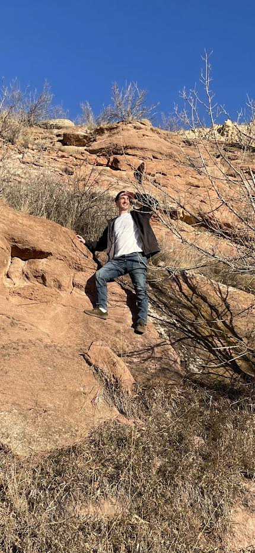

# Hi, I'm Oliver

Tech and learning new things are some of my lifelong passions. All the way back in the early days of the internet, I was selected to participate in a Microsoft study focused on young internet users. This experience sparked my enthusiasm for all things tech and opened my eyes to the exciting world of code and software development.

Fast-forward to today, I have recently completed my Associates of Applied Science in Information Systems and Code Fellows Software Development bootcamp, where I learned the fundamentals of how to write code.

I believe that software developers have the ability to make the world a better place by creating code that is intuitive, inclusive and accessible.

Please feel free to schedule a call with me or message me about anything, I'd love the opportunity to connect.

(style:'display:flex; margin-right: auto; margin-left: auto;', aria-hidden:true)